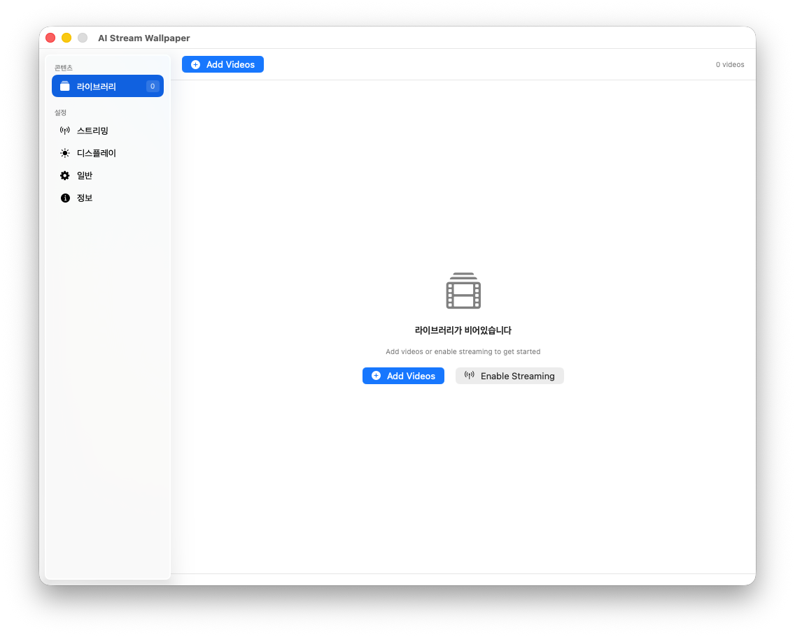
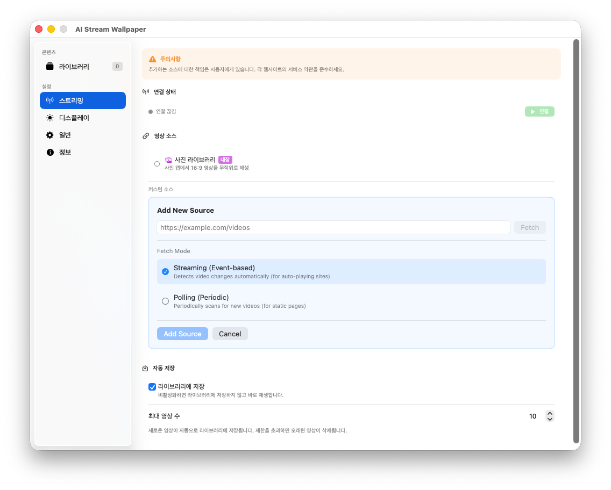
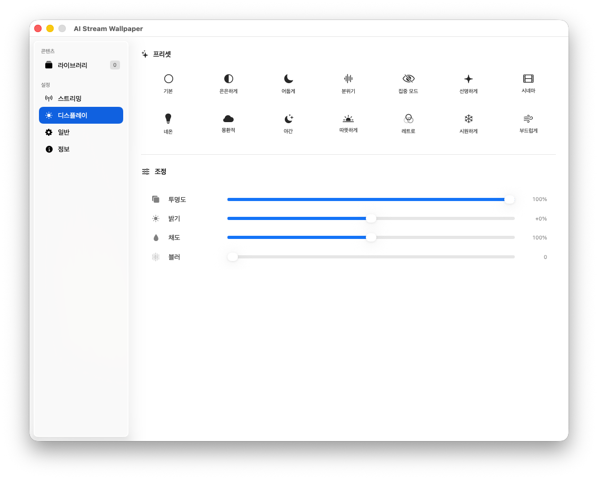
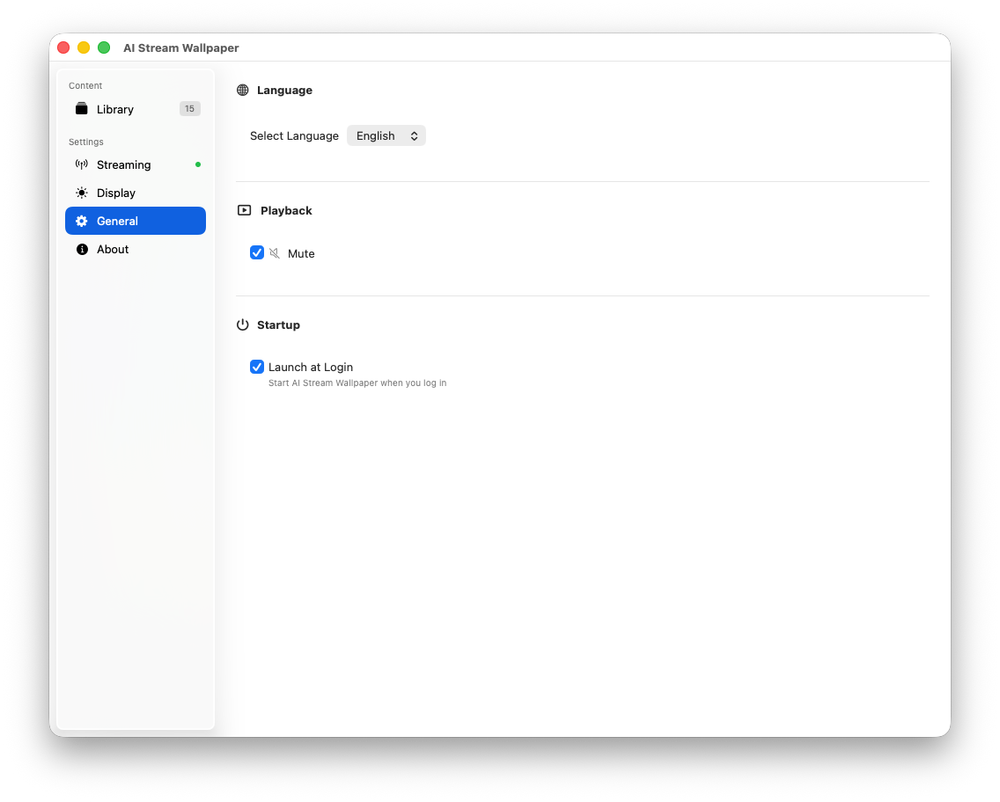
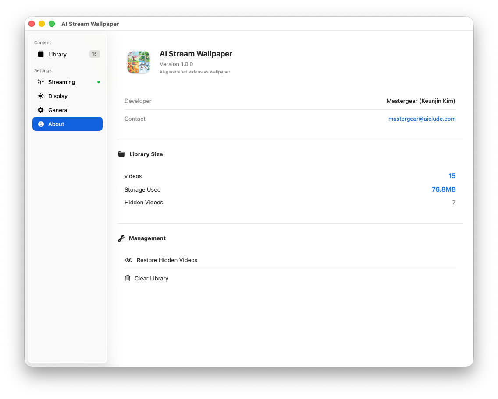

# AI Stream Wallpaper

<p align="center">
  
  
  
  
</p>

<p align="center">
  <b>AI-generated videos as your macOS desktop wallpaper</b>
</p>

<p align="center">
  <i>🎨 An unofficial fan-made application by a Midjourney enthusiast</i>
</p>

<p align="center">
  <b>English</b> | <a href="README.ko.md">한국어</a> | <a href="README.ja.md">日本語</a>
</p>

A macOS app that displays real-time AI-generated videos from Midjourney TV as your desktop wallpaper, with automatic saving to a local library for offline viewing.

> 💡 **Note**: While this app was originally designed for Midjourney TV, it can also connect to **other streaming video services** that provide similar video streams, allowing you to use any compatible video stream as your Mac's dynamic wallpaper.

> ⚠️ **Disclaimer**: This is an unofficial fan-made application and is not affiliated with, endorsed by, or connected to Midjourney, Inc. in any way. See [Disclaimer](#️-disclaimer) section for more details.

---

## ✨ Features

### 🎬 Streaming Connection
- **Background Midjourney TV Connection** - Real-time video streaming via WebView
- **Custom Video Sources** - Add your own streaming video URLs beyond Midjourney TV
- **Buffer Mode (Default)** - Play videos directly without saving for ToS compliance
- **Optional Auto-Save** - Users can explicitly enable saving to library if desired
- **Network Status Monitoring** - Auto-reconnect when connection drops

### 📚 Library Management
- **SQLite Database** - Persistent video metadata storage
- **Auto Thumbnail Generation** - Extracts thumbnails using AVAssetImageGenerator
- **Favorites & Play Count Tracking**
- **Hide Videos (Dislike)** - Hide unwanted videos from rotation
- **Smart Cleanup** - Automatically removes oldest videos when limit is exceeded

### 🖥️ Wallpaper Playback
- **Desktop-Level Window** - True wallpaper displayed below desktop icons
- **Multi-Monitor Support** - Independent video playback on each monitor
- **Continuous Playback** - Sequential/loop playback from library
- **Overlay Settings** - Adjust transparency, brightness, saturation, and blur

### 🌏 Localization
- English (en)
- 한국어 (ko)
- 日本語 (ja)

---

## 📖 User Guide

### 1️⃣ Library

<p align="center">
  
</p>

Manage your saved AI-generated videos in a grid layout.

- **Thumbnail Preview**: Shows representative image for each video
- **Play Video**: Click to set as wallpaper
- **Right-Click Menu**: 
  - Set as wallpaper
  - Copy prompt
  - Open in Midjourney
  - Show in Finder
  - Hide / Delete

---

### 2️⃣ Streaming Settings

<p align="center">
  
</p>

Configure Midjourney TV connection and auto-save settings.

| Option | Description |
|--------|-------------|
| **Connection Status** | Streaming connection state (Connected/Disconnected) |
| **Video Source** | Midjourney TV (default) or add custom URLs |
| **Save to Library** | When enabled, automatically saves new videos to library (**OFF by default**) |
| **Maximum Videos** | Max videos to keep in library (older videos auto-deleted when exceeded) |

> 🛡️ **Default: Buffer Mode** - By default, auto-save is disabled to comply with service terms. Videos are played directly without saving. Users can explicitly enable saving if they choose.

> 💡 **Tip**: When streaming is connected, the app monitors the video source in the background and automatically downloads new videos as they appear.

> 🔗 **Custom Sources**: You can add any streaming video service URL that provides continuous video content. This makes the app versatile for various video wallpaper sources beyond Midjourney TV.

---

### 3️⃣ Display Settings

<p align="center">
  
</p>

Adjust visual effects for your wallpaper.

**Presets**
| Preset | Effect |
|--------|--------|
| Default | Original appearance |
| Subtle | Slightly dimmed |
| Dim | Darkened |
| Ambient | Atmospheric mood |
| Focus | Focus mode (adds blur) |
| Vivid | Enhanced colors |
| Cinema | Cinematic look |
| Neon | Neon effect |
| Dreamy | Dreamlike appearance |
| Night | Night mode |
| Warm | Warm tones |
| Retro | Retro style |
| Cool | Cool tones |
| Soft | Softened |

**Manual Adjustments**
- **Transparency**: Wallpaper opacity (0~100%)
- **Brightness**: Brightness adjustment (-100% ~ +100%)
- **Saturation**: Color saturation (0~200%)
- **Blur**: Blur effect (0~50)

---

### 4️⃣ General Settings

<p align="center">
  
</p>

Configure basic app behavior.

| Option | Description |
|--------|-------------|
| **Language** | App language selection (English, 한국어, 日本語) |
| **Mute** | Mute video audio |
| **Launch at Login** | Start automatically when you log in |

---

### 5️⃣ About

<p align="center">
  
</p>

View app information and manage your library.

- **Developer**: Mastergear (Keunjin Kim)
- **Contact**: mastergear@aiclude.com
- **Library Size**: Video count, storage used, hidden videos count
- **Management**: 
  - Restore hidden videos
  - Clear entire library

---

## 📋 Requirements

- **macOS 13.0 (Ventura)** or later
- **Xcode 15.0** or later (for building)

---

## 🚀 Build

### Build with Xcode

1. Open `AIStreamWallpaper.xcodeproj` in Xcode
2. Select the `AIStreamWallpaper` scheme
3. Product > Build (⌘B)

### Build from Command Line

```bash
xcodebuild -project AIStreamWallpaper.xcodeproj \
           -scheme AIStreamWallpaper \
           -configuration Release \
           -derivedDataPath build
```

Built app location: `build/Build/Products/Release/AIStreamWallpaper.app`

### Create DMG Distribution

```bash
./build-dmg.sh
```

Output: `dist/AIStreamWallpaper.dmg`

---

## 🏗️ Architecture

```
AIStreamWallpaper/
├── App/                      # App entry point
│   ├── AIStreamWallpaperApp.swift   # @main, MenuBarExtra setup
│   └── AppDelegate.swift            # App lifecycle, window management
│
├── Models/                   # Data models
│   ├── Configuration.swift          # App settings structs
│   └── VideoItem.swift              # Video metadata model
│
├── Views/                    # UI components
│   ├── MenuBarView.swift            # Menu bar dropdown UI
│   ├── MainWindowView.swift         # Unified main window
│   ├── LibraryBrowserView.swift     # Library grid view
│   ├── MiniControlsView.swift       # Floating mini controller
│   └── Settings/                    # Settings tabs
│       ├── GeneralSettingsView.swift
│       ├── StreamingSettingsView.swift
│       ├── OverlaySettingsView.swift
│       └── ShortcutSettingsView.swift
│
├── Wallpaper/               # Wallpaper rendering
│   ├── WallpaperManager.swift       # Overall wallpaper management
│   ├── WallpaperWindow.swift        # Desktop-level window
│   ├── VideoWallpaperView.swift     # AVPlayer-based local playback
│   └── WebWallpaperView.swift       # WKWebView-based streaming
│
├── Capture/                 # Video capture
│   ├── VideoInterceptor.swift       # WebView video URL detection
│   ├── DownloadManager.swift        # Video download
│   └── MetadataExtractor.swift      # Midjourney metadata extraction
│
├── Library/                 # Library management
│   ├── LibraryDatabase.swift        # SQLite CRUD
│   ├── LibraryManager.swift         # High-level library management
│   └── ThumbnailGenerator.swift     # Thumbnail generation
│
├── Playback/                # Playback control
│   └── PlaybackController.swift     # Playback state, navigation
│
├── Services/                # Background services
│   ├── ConfigurationManager.swift   # JSON settings management
│   ├── HotkeyManager.swift          # Global hotkeys
│   ├── LocalizationManager.swift    # Localization handling
│   ├── MonitorManager.swift         # Multi-monitor detection
│   ├── NetworkMonitorService.swift  # Network status monitoring
│   └── SchedulerService.swift       # Schedule/battery/fullscreen detection
│
└── Resources/               # Resources
    ├── Info.plist
    ├── AIStreamWallpaper.entitlements
    └── [ko/en/ja].lproj/            # Localized strings
        └── Localizable.strings
```

---

## 🔧 Implementation Details

### Desktop-Level Window

How to display a window below Finder icons on macOS:

```swift
class WallpaperWindow: NSWindow {
    init(screen: NSScreen) {
        super.init(contentRect: screen.frame, ...)
        
        // Set to desktop level (below icons)
        level = NSWindow.Level(rawValue: Int(CGWindowLevelForKey(.desktopWindow)))
        
        // Show on all Spaces, exclude from window cycle
        collectionBehavior = [.canJoinAllSpaces, .stationary, .ignoresCycle]
        
        // Pass through mouse events (allow clicking desktop)
        ignoresMouseEvents = true
    }
}
```

### Streaming Connection Flow

```
[Midjourney TV]
     ↓ (WebView load)
[WebWallpaperView] ← Running in hidden window
     ↓ (Video URL detection)
[VideoInterceptor]
     ↓ (Download)
[DownloadManager]
     ↓ (Save)
[LibraryDatabase] → [LibraryManager]
     ↓ (Playback)
[PlaybackController] → [VideoWallpaperView]
```

### Configuration Structure

```swift
AppConfiguration
├── streaming: StreamingConfiguration
│   ├── connectionEnabled: Bool      // Streaming connection ON/OFF
│   ├── autoSaveEnabled: Bool        // Auto-save enabled
│   └── autoSaveCount: Int           // Maximum save count
├── library: LibraryConfiguration
│   ├── path: String                 // Library path
│   └── currentVideoId: String?      // Currently playing video
├── behavior: BehaviorConfiguration
│   ├── autoStart: Bool              // Launch at login
│   ├── muteAudio: Bool              // Mute audio
│   └── useAsWallpaper: Bool         // Use as wallpaper
├── overlay: OverlayConfiguration
│   ├── opacity: Double              // 0.0 ~ 1.0
│   ├── brightness: Double           // -1.0 ~ 1.0
│   ├── saturation: Double           // 0.0 ~ 2.0
│   └── blur: Double                 // 0.0 ~ 50.0
└── shortcuts: ShortcutConfiguration
```

---

## 📁 Data Storage Location

```
~/Library/Application Support/AIStreamWallpaper/
├── config.json          # App settings
├── library.sqlite       # Video metadata DB
├── videos/              # Downloaded video files
│   └── {uuid}.mp4
├── thumbnails/          # Thumbnail images
│   └── {uuid}.jpg
└── Buffer/              # Buffer mode temp files
```

---

## 🚀 Auto-Start Setup

Launch at login is implemented via LaunchAgent:

```
~/Library/LaunchAgents/com.aistreamwallpaper.plist
```

Enable "Launch at Login" from the menu bar or settings to auto-generate this file.

---

## ⚠️ Disclaimer

### Fan-Made Application

This application was created by a **Midjourney user and fan** out of appreciation for Midjourney's amazing AI-generated content. It is designed to enhance the user experience by allowing Midjourney TV videos to be enjoyed as desktop wallpapers.

### Versatile Video Wallpaper Tool

While originally designed with Midjourney TV in mind, this application functions as a **general-purpose streaming video wallpaper tool** for macOS. Users can connect to **any compatible streaming video service** to use as their desktop wallpaper, making it useful even independent of Midjourney TV.

### Not Intended to Cause Harm

This application is **NOT** intended to:
- Cause any harm or damage to Midjourney, Inc. or its services
- Infringe upon Midjourney's intellectual property rights
- Bypass any access controls or terms of service
- Compete with or undermine Midjourney's business

### Compliance with Midjourney's Policies

The developer commits to the following:

1. **Cease and Desist**: If Midjourney, Inc. requests that this application be discontinued, distribution will be **immediately stopped** without delay.

2. **Service Termination**: If Midjourney TV service is discontinued or substantially changed, this application's distribution will be promptly ceased.

3. **Good Faith**: This application is distributed in good faith for personal, non-commercial use by fellow Midjourney enthusiasts.

### No Affiliation

- This is an **unofficial**, **fan-made** application
- **NOT** affiliated with, endorsed by, or connected to Midjourney, Inc.
- All Midjourney trademarks and content belong to their respective owners
- "Midjourney" and "Midjourney TV" are trademarks of Midjourney, Inc.

### Copyright of Downloaded Content

- All videos downloaded from Midjourney TV are **copyrighted by their original creators**
- Downloaded videos are intended for **personal, non-commercial use only**
- Users must **NOT redistribute, sell, or commercially exploit** downloaded content
- The copyright of AI-generated content belongs to Midjourney and/or its users as per Midjourney's Terms of Service

### User Responsibility

Users of this application are responsible for:

1. **Compliance with Terms of Service**: Users must comply with Midjourney TV's Terms of Service and any other streaming service they connect to
2. **Legal Use**: Users must ensure their use of this application complies with applicable laws in their jurisdiction
3. **Third-Party Services**: When connecting to services other than Midjourney TV, users are solely responsible for compliance with those services' terms
4. **Content Usage**: Users are responsible for how they use any content obtained through this application

### Important Notice Regarding Midjourney ToS

According to [Midjourney's Terms of Service](https://docs.midjourney.com/hc/en-us/articles/32083055291277-Terms-of-Service), the following restrictions apply:

> "You may not use **automated tools** to access, interact with, or generate Assets through the Services."

**This application addresses ToS concerns by:**
- ✅ **Buffer Mode is enabled by default** - Videos are played directly without saving
- ✅ **Auto-save is disabled by default** - Users must explicitly opt-in to save videos
- ✅ Designed for **personal viewing enjoyment**, not systematic data collection

**Users should be aware that:**
- If you enable auto-save, you do so at your own discretion and risk
- This application is intended for **personal enjoyment** of publicly available content

### Privacy

This application:
- **Does NOT collect any personal data**
- **Does NOT transmit any data to external servers** (except for connecting to user-specified streaming sources)
- **Stores all data locally** on the user's device only
- **Does NOT include any analytics or tracking**

### Warranty Disclaimer

THIS SOFTWARE IS PROVIDED **"AS IS"**, WITHOUT WARRANTY OF ANY KIND, EXPRESS OR IMPLIED, INCLUDING BUT NOT LIMITED TO THE WARRANTIES OF MERCHANTABILITY, FITNESS FOR A PARTICULAR PURPOSE, AND NONINFRINGEMENT.

IN NO EVENT SHALL THE AUTHORS OR COPYRIGHT HOLDERS BE LIABLE FOR ANY CLAIM, DAMAGES, OR OTHER LIABILITY, WHETHER IN AN ACTION OF CONTRACT, TORT, OR OTHERWISE, ARISING FROM, OUT OF, OR IN CONNECTION WITH THE SOFTWARE OR THE USE OR OTHER DEALINGS IN THE SOFTWARE.

### Contact

For any concerns regarding this application:
- **Developer**: mastergear@aiclude.com
- **Midjourney**: Please contact the developer if you have any concerns, and appropriate action will be taken immediately.

---

## 📝 License

**CC BY-NC-SA 4.0** (Creative Commons Attribution-NonCommercial-ShareAlike 4.0)

| Term | Description |
|------|-------------|
| **Attribution (BY)** | You must give appropriate credit and indicate if changes were made |
| **NonCommercial (NC)** | You may not use the material for commercial purposes |
| **ShareAlike (SA)** | If you modify the source, you must distribute under the same license |

> 📧 For commercial licensing inquiries: mastergear@aiclude.com

Full license text: [CC BY-NC-SA 4.0](https://creativecommons.org/licenses/by-nc-sa/4.0/legalcode)

---

## 🙏 Credits

- [Midjourney TV](https://www.midjourney.tv/) - AI-generated video source
- SwiftUI & AppKit - macOS native UI
- AVFoundation - Video playback and processing
- WebKit - Web content rendering

---

## 👨‍💻 Author

**Mastergear (Keunjin Kim)**  
📧 mastergear@aiclude.com
